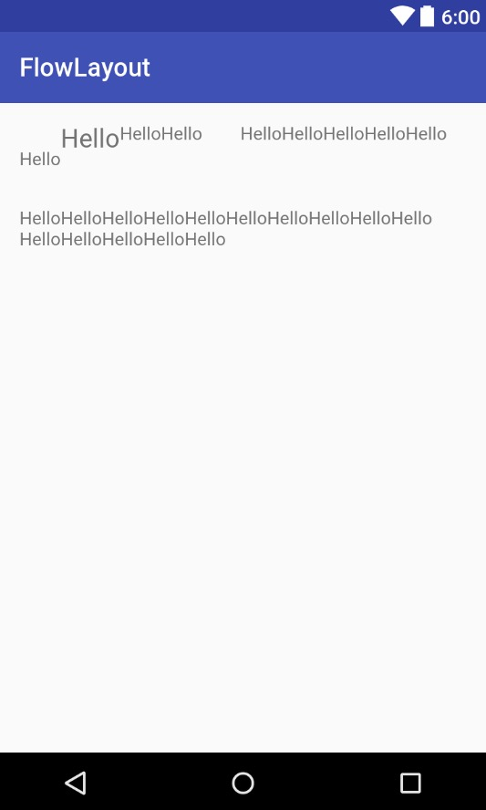

# FlowLayout

If you want to put all your subviews into one layout. LinearLayout or RelativeLayout won't help you. Just come and see the new FlowLayout!

##Sample



## How To Add
Step 1: Add it in your root build.gradle at the end of repositories:


```
allprojects {
	repositories {
		...
		maven { url "https://jitpack.io" }
	}
}
```

Step 2: Add the dependency

```
dependencies {
	compile 'com.github.abcghy:FlowLayout:v1.0.0'
}
```


## How To Use
Just put all your views in the FlowLayout!

## Next thing to do
* add orientation(now it's only left to right)